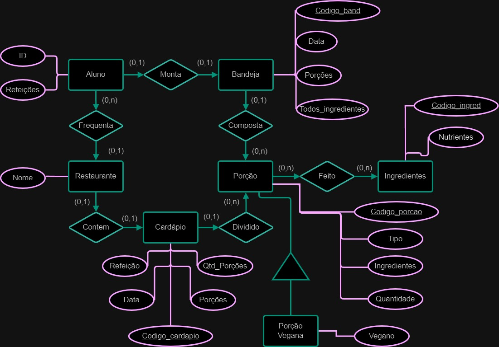

# Modelagem Relacional de Refeições em um Restaurante

Estrutura de pastas:

~~~
├── README.md  <- arquivo apresentando a tarefa
│
└── ER  <- arquivos de imagem ER, revisado
~~~

# Equipe PLAY
# Subgrupo SAMPA

* José Felipe Theodoro - RA:219081
* Gustavo Henrique Luiz Merlo - RA:171401

## Modelo conceitual ER Revisado

## Mapeamento para o Modelo Relacional

~~~
RESTAURANTE(_Nome_)
ALUNO(_ID_, Refeições)
  Refeições chave estrangeira -> Bandeja(Codigo_band)
BANDEJA(_Codigo_band_, Data, Porções, Todos_ingredientes)
  Porções chave estrangeira -> Porção(Codigo_porcao)
  Todos_ingredientes chave estrangeira -> INGREDIENTES(Codigo_ingred)
CARDÁPIO(_Codigo_cardapio_, Refeição, Data, Qtd_Porções, Porções)
  Porções chave estrangeira -> PORÇÃO(Codigo_porcao)
  Qtd_Porções chave estrangeira -> PORÇÃO(Codigo_porcao)
PORÇÃO(_Codigo_porcao_, Tipo, Ingredientes, Quantidade)
  Ingredientes chave estrangeira -> INGREDIENTES(Codigo_ingred)
PORÇÃO_VEGANA(_Codigo_porcao_, Vegano)
INGEDRIENTES(_Codigo_ingred_, Nutrientes)

~~~
