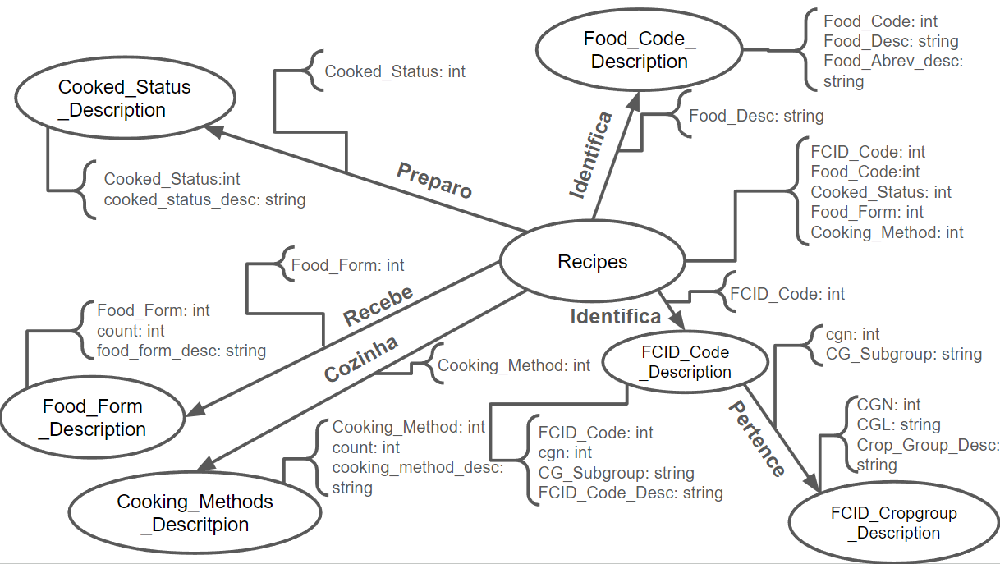

# Modelo para Apresentação do Lab07 - Modelo Lógico para Banco de Dados de Grafos

Estrutura de pastas:

~~~
├── README.md  <- arquivo apresentando a tarefa
│
└── images     <- arquivos de imagem usados na tarefa
~~~

# Equipe `PLAY`

# Subgrupo `SAMPA`
* `Gustavo Henrique Luiz Merlo` - `171401`
* `José Felipe Theodoro` - `219081`

## Modelo Lógico do Banco de Dados de Grafos
> 

## Perguntas de Pesquisa/Análise

> Liste aqui as três perguntas de pesquisa/análise
> * Como preparar uma receita dados seu Food_Code e Cooked_Status?
> * Como uma receita é servida dados Food_Code e Food_Form?
> * Qual FCID_Desc de um ingrediente dado seu FCID_Code?

