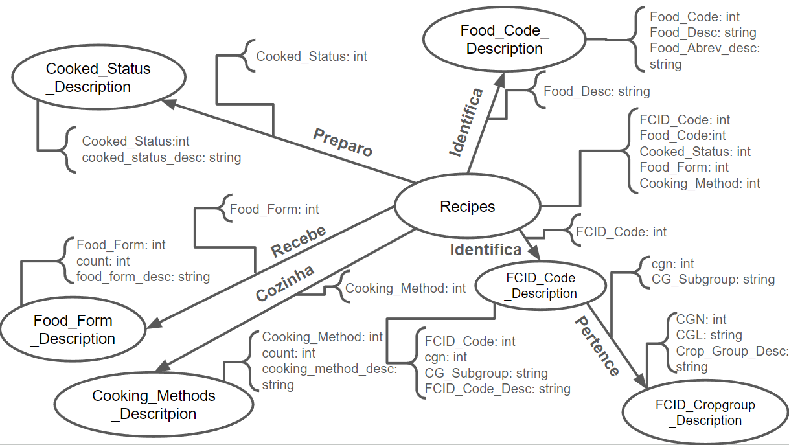

Estrutura de pastas:

~~~
├── README.md  <- arquivo apresentando a tarefa
│
└── images     <- arquivos de imagem usados na tarefa
~~~

# Equipe `PLAY`

# Subgrupo `SAMPA`
* `José Felipe Theodoro` - `219081`
* `Gustavo Henrique Luiz Merlo` - `171401`

## Modelo Lógico do Banco de Dados de Grafos
> 

## Perguntas de Pesquisa/Análise Combinadas e Respectivas Análises

> Liste aqui as perguntas de pesquisa/análise e respectivas análises.
>
### Pergunta/Análise 1
> * Pergunta 1
>   
>   * Explicação sucinta da análise que será feita no grafo para atender à pergunta. Deve ser indicado explicitamente em qual das modalidades a análise se encaixa: centralidade; vulnerabilidade; comunidade/modularidade; motifs; predição de links.

### Pergunta/Análise 2
> * Quais as consequências de perda de dados de Recipes?
>   
>   * Como podemos verificar no grafo e na pergunta anterior podemos identificar a alta importância de Recipes o que torna possível afirmar que  existe um alto grau de vulnerabilidade nessa organização, pois a perca de dados contidos em Recipes podem tornar as informações de outros nós inutilizáveis. Um exemplo seria a perda das informações acerca "Cooked_Status: int", tal perda faria com que as informações presentes no nó Cooked_Status percam sua utilidade.

### Pergunta/Análise 3
> * Pergunta 3
>   
>   * Explicação sucinta da análise que será feita no grafo para atender à pergunta. Deve ser indicado explicitamente em qual das modalidades a análise se encaixa: centralidade; vulnerabilidade; comunidade/modularidade; motifs; predição de links.
